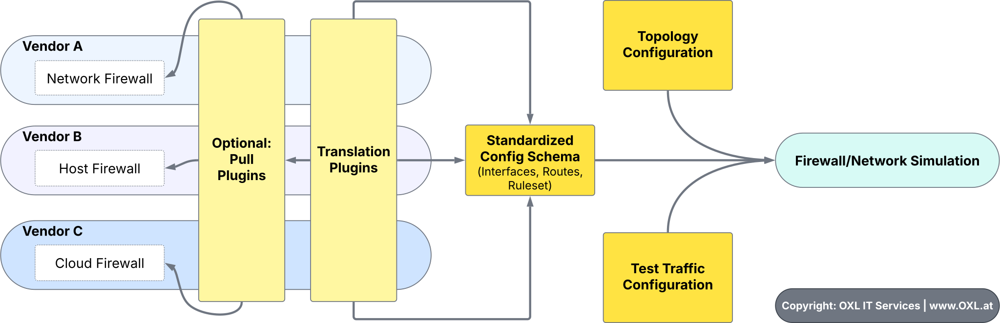

.. _dev_intro:

.. include:: ../_include/head.rst

=====================
1 - Development Intro
=====================

Guidelines
##########

Feel free to contribute to this project using `pull-requests <https://github.com/O-X-L/firewall-testing-framework/pulls>`_, `issues <https://github.com/O-X-L/firewall-testing-framework/issues>`_ and `discussions <https://github.com/O-X-L/firewall-testing-framework/discussions>`_!

Testers are also very welcome! Please `give feedback <https://github.com/O-X-L/firewall-testing-framework/discussions>`_

For further details - see: `Contribute <https://github.com/O-X-L/firewall-testing-framework/blob/latest/CONTRIBUTE.md>`_

* Please do not post any generic AI-slop.. thanks.

* Be friendly and respectful

Roadmap
=======

Please take a took `at the roadmap <https://github.com/O-X-L/firewall-testing-framework/blob/latest/README.md>`_ before submitting any changes.

Also make sure the changes are in-scope.

----

Scope
#####

We initially need to focus on building the core simulator and cover the most useful cases!

Thus we are required to set some limits!

Out-of-Scope
============

Some of this features might be make sense later on.

* Transparent firewalls (layer 2 interception)
* Non-IP traffic (layer 2 ARP/bridge layer)
* Application-Level Protocols
* Automatic connection-simulation
* Rule-based routing (fwmark with routing-table lookup)
* Simulation of dynamic routing (we only use the routes provided to the translate-plugins - static or runtime export)
* Applying multiple DNAT or SNAT rules for a single packet

Principles
==========

* **Strict separation of vendor-specific plugins** from the core traffic-simulator.

  Plugins CAN be used to pull the current configuration (rulesets, interfaces, routes) from a firewall system, but admins should always be able to manually provide this information.

  Some might not want to trust some 'nice-to-have' tool with access to their firewalls.

* The user should be able to choose the **output verbosity**.

  We want to provide full transparency (*show every rule the traffic interacts with*) but if not required (*p.e in automated/CI-mode*) it should be brief.

----

Tools & Know-How
################

Debug Output
************

You can set the environmental-variable :code:`export DEBUG=1` to get more verbose output!

----

Code Structure
##############

1. Entrypoint
=============

**Files**: :code:`src/firewall_test/cli.py`, :code:`src/firewall_test/ci.py`, :code:`src/firewall_test/shell.py`

The entrypoints are designed to be executed by the user.

**Options**:

* :code:`cli` can be executed by the command :code:`ftf-cli`

 It is designed to be a one-shot simulation of a packet

* :code:`ci` can be executed by the command :code:`ftf-ci`

  .. warning::

     To be implemented.

 It is designed to simulate many packets. A test-traffic configuration-file needs to be provided!

* :code:`shell` can be executed by the command :code:`ftf-shell`

  .. warning::

     To be implemented.

 It is designed to be an interactive shell for simulating multiple packets.

----

2. Simulated Packets
====================

**Files**: :code:`src/firewall_test/simulator/packet.py`

The network-traffic configuration as provided by the user is parsed to packets.

----

3. Config Loader
================

**Files**: :code:`src/firewall_test/simulator/loader.py`, :code:`src/firewall_test/plugins/system/config.py` (mapping target-system to translate-plugins), :code:`:code:`src/firewall_test/system/*` (target-system config), :code:`/home/rath/code/firewall-testing-framework/src/firewall_test/plugins/translate/*` (translate plugins)

The configuration-files provided by the user are loaded and parsed as configured for the target firewall-system.

1. Loading the target-system config (:code:`plugins/system/*`)
2. Reading the config-files provided by the user
3. Parsing the configuration as implemented by the target-system-specific translate-plugins (:code:`plugins/translate/*`)

----

4. Simulator Initialization
===========================

**Files**: :code:`src/firewall_test/simulator/main.py`, :code:`src/firewall_test/simulator/router.py`, :code:`src/firewall_test/simulator/firewall.py`

1. The loaded configuration is passed to the simulator.

2. The simulator initializes the routing- and firewall-simulators

3. The routing-simulator initializes the routing-priorities

----

.. _dev_intro_simulation:

5. Simulating Traffic
=====================

1. A :code:`SimulatorRun` is initialized

2. **It is checked which kind of traffic-flow applies**

  * If the source or destination IPs are local to the firewall

  * Estimated traffic-flow (:code:`input, forward or output`)

3. **The source-route is looked-up**

  * The routing-simulator is queried for the source-route

  * Updates the inbound-interface

  * Throws an error if no source-route was found

  .. tip::

      The detailed function of the :ref:`routing- and firewall-simulators are covered later on <dev_intro_router>`_.

4. **Pre-Routing and Pre-DNAT Firewall-Filters are processed**

5. **Destination-NAT is processed**

  * Updating if the destination IP is local to the firewall

  * Updates the traffic-flow

6. **The destination-route is looked-up**

  * The routing-simulator is queried for the destination-route

  * Updates the outbound-interface

  * Throws an error if no destination-route was found

7. **System-specific filters**

  * These are custom filters that might be outside the control of the firewall-ruleset itself (like Linux kernel)

  * Drops traffic to bogon-networks on WAN - if the firewall-system if configured to

8. **Main Firewall-Filters are processed**

9. **Source-NAT is processed**

10. **Optional: Post-SNAT Firewall-Filters are processed**

11. **The packet might have passed**

----

Simulating Traffic through multiple Firewall-Systems
####################################################

This functionality is still under development.

Basically we will have to parse the routes of all firewall-systems to create a simulation-topology.

This topology should allow us to place the packets by looking-up their source-IP.

More complex setups with duplicate subnets might be supported later on.

----

Routing & Firewalling
#####################

.. _dev_intro_router:

Routing Simulator
=================

tbd

.. _dev_intro_firewall:

Firewall Simulator
==================

tbd
