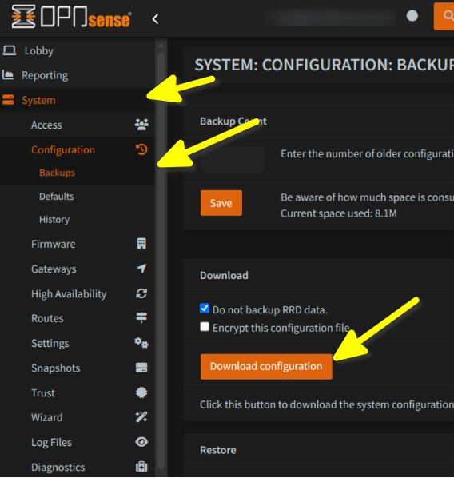
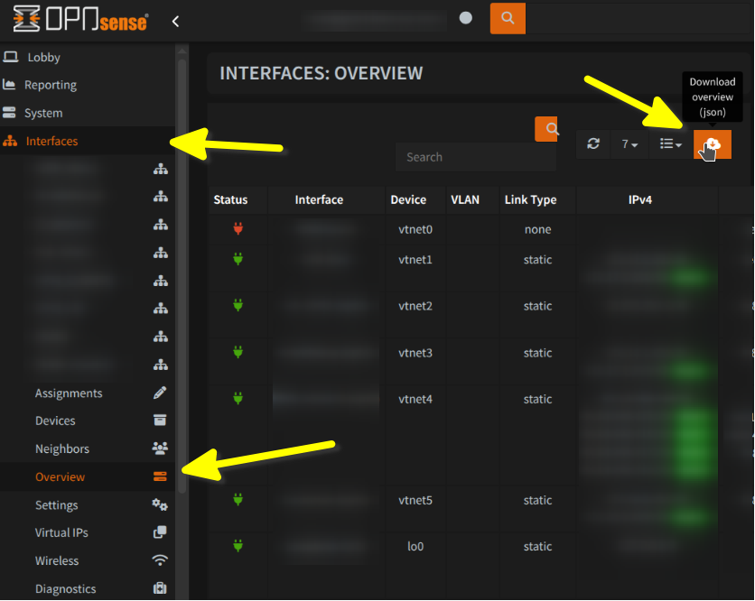

.. _plugins_fw_opnsense:

.. include:: ../_include/head.rst

===================
Firewall - OPNsense
===================

.. include:: ../_include/warn_develop.rst

Config Export
#############

1. `Download a Config-Backup <https://docs.opnsense.org/manual/backups.html>`_ (referenced as :code:`config.xml`)

    |export_backup|

2. Download the current network status via the WebUI: :code:`Interfaces - Overview - Download Buttom` (referenced as :code:`network.json`)

    |export_network|

----

Run
###

Here is an example on how to run supply the exported config:

.. code-block:: bash

    ftf-cli --firewall-system 'opnsense' \
            --file-ruleset 'config.xml' \
            --file-interfaces 'network.json' \
            --file-routes 'network.json' \
            --src-ip 172.17.11.5 \
            --dst-ip 1.1.1.1

----

Source Code
###########

* **System Config**: `system/system_opnsense.py <https://github.com/O-X-L/firewall-testing-framework/blob/latest/src/firewall_test/plugins/system/system_opnsense.py>`_

* **Config Parsing**: `translate/opnsense/ <https://github.com/O-X-L/firewall-testing-framework/tree/latest/src/firewall_test/plugins/translate/opnsense>`_

* **Traffic Matching**: `system/firewall_opnsense.py <https://github.com/O-X-L/firewall-testing-framework/blob/latest/src/firewall_test/plugins/system/firewall_opnsense.py>`_

