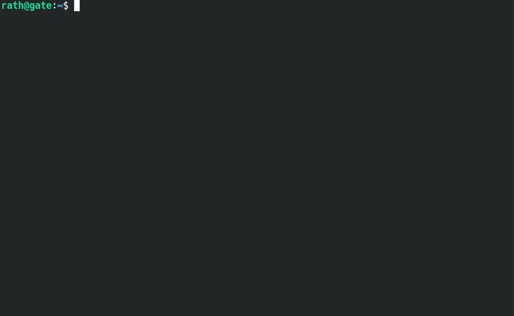

.. _usage_intro:

.. |topology| image:: ../_static/img/topology.svg
   :class: wiki-img

.. include:: ../_include/head.rst

=========
1 - Intro
=========

|topology|

|intro_gif|

Goal / Reason / Why?
####################

When having to administer IT infrastructure and networks - we will often have multiple firewalls in place.

Maintaining these might be time-consuming. You might also face some challenges:

Troubleshooting & Analysis
==========================

Even for senior network engineers it can be a challenge to find the source of an unexpected block/accept in large rulesets that are distributed across multiple systems and firewall vendors.

Infrastructure-as-Code does help to keep the rulesets in a consistent state - but it does not solve the issue of having to manually analyze/troubleshoot existing rulesets.

This project wants to provide one interface for simulating traffic over multiple firewall systems.

Automated Regression-Tests
==========================

**Why would you want to do ruleset-regression-tests?**

* You may want/need to periodically verify that the currently active rulesets actually allow/deny the traffic you expect

  This can be a tedious task - you might overlook some edge-case.

* Especially when a ruleset is administered by teams of engineers over a long time period - it can be a challenge to:

* detect configuration errors/mistakes before they can be exploited

* make sure the design-choices for the ruleset are adhered to

* If you already utilize Infrastructure-as-Code and change-reviews for updating your rulesets you might want to also validate the functionality of that ruleset via automated CI-jobs.

**How do regression-tests work?**

* You define test-cases that simulate traffic over one or multiple firewalls

* You assert that the traffic was allowed/denied/rejected

* You might even want to assert that the traffic took a specific outbound route or was NATed to a specific IP

This way you can continuously extend these test-cases and easily verify that the currently active rulesets comply with them.

----

Overview
########

Please take a took `at the roadmap <https://github.com/O-X-L/firewall-testing-framework/blob/latest/README.md>`_ before submitting any changes.

1. **Provide the firewall configuration**:

   * manually pull the current config from the existing firewalls

   * or utilize existing :code:`pull-plugins` to do so (p.e. via API)

2. **Vendor-specific plugins**:

   vendor-specific configuration gets parsed by :code:`translation-plugins` which output a standardized firewall config-schema.

3. **Run**:

   * Use the **one-shot CLI** (:code:`command: ftf-cli`)

   * Enter an interactive shell (:code:`command: ftf-shell`)

     .. warning::

         Still under development.

   * Run **automated tests** (:code:`command: ftf-ci`) by providing a test-traffic configuration

     .. warning::

         Still under development.

5. **The Simulator**

   * parses the provided config

   * generates the network-topology

   * finds where the packet originates from

   * finds the route the packet should take

   * tests the traffic against the rulesets of firewalls that are hops of that route

